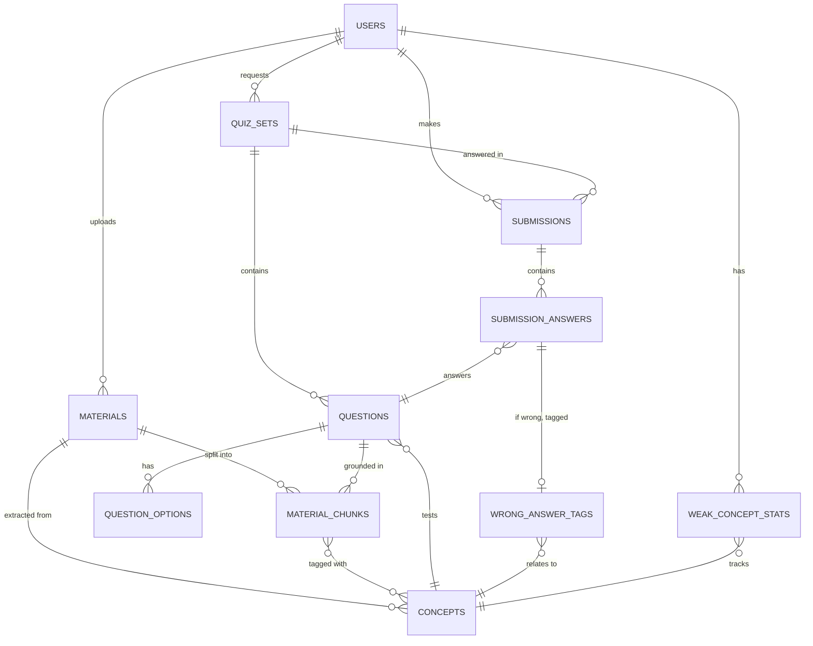

# DB 스키마 (PostgreSQL 기준)

## 1. ER 다이어그램 (Mermaid — GitHub에서 바로 렌더링됨)

## 2. 테이블 정의

### users
| 컬럼 | 타입 | 설명 |
|---|---|---|
| id | UUID (PK) | |
| email | VARCHAR, UNIQUE | |
| name | VARCHAR | |
| created_at | TIMESTAMP | |

### materials (업로드 자료)
| 컬럼 | 타입 | 설명 |
|---|---|---|
| id | UUID (PK) | |
| user_id | UUID (FK → users) | |
| title | VARCHAR | 과목/자료명 |
| file_type | VARCHAR | pdf / ppt / txt |
| file_path | VARCHAR | 원본 저장 경로 |
| status | VARCHAR | uploaded / processing / ready / failed |
| created_at | TIMESTAMP | |

### material_chunks (자료 청크, RAG용)
| 컬럼 | 타입 | 설명 |
|---|---|---|
| id | UUID (PK) | |
| material_id | UUID (FK → materials) | |
| page_or_slide_no | INT | 출처 표기용 |
| content | TEXT | 청크 원문 |
| embedding | VECTOR(1536) | pgvector, 검색용 임베딩 |
| created_at | TIMESTAMP | |

### concepts (핵심 개념)
| 컬럼 | 타입 | 설명 |
|---|---|---|
| id | UUID (PK) | |
| material_id | UUID (FK → materials) | |
| name | VARCHAR | 개념명 (예: "칼만 필터") |
| description | TEXT | 개념 요약 |
| parent_concept_id | UUID (FK → concepts, nullable) | 상위 개념 (계층 구조용) |

### quiz_sets (출제 세트 — 최초 생성 or 재출제 모두 포함)
| 컬럼 | 타입 | 설명 |
|---|---|---|
| id | UUID (PK) | |
| user_id | UUID (FK → users) | |
| material_id | UUID (FK → materials) | |
| type | VARCHAR | initial / regenerated |
| source_quiz_set_id | UUID (FK → quiz_sets, nullable) | 재출제일 경우 원본 세트 참조 |
| target_concept_ids | UUID[] | 재출제 시 타겟 취약개념 목록 |
| difficulty | VARCHAR | easy / medium / hard |
| created_at | TIMESTAMP | |

### questions
| 컬럼 | 타입 | 설명 |
|---|---|---|
| id | UUID (PK) | |
| quiz_set_id | UUID (FK → quiz_sets) | |
| concept_id | UUID (FK → concepts) | 이 문제가 검증하는 개념 |
| type | VARCHAR | multiple_choice / short_answer |
| question_text | TEXT | |
| correct_answer | TEXT | 단답형 정답 or 객관식 정답 인덱스 |
| explanation | TEXT | 해설 |
| source_chunk_id | UUID (FK → material_chunks) | 근거 출처 (grounding) |

### question_options (객관식 보기)
| 컬럼 | 타입 | 설명 |
|---|---|---|
| id | UUID (PK) | |
| question_id | UUID (FK → questions) | |
| option_text | TEXT | |
| is_correct | BOOLEAN | |
| option_order | INT | |

### submissions (풀이 세션)
| 컬럼 | 타입 | 설명 |
|---|---|---|
| id | UUID (PK) | |
| user_id | UUID (FK → users) | |
| quiz_set_id | UUID (FK → quiz_sets) | |
| score | NUMERIC | 정답률 |
| submitted_at | TIMESTAMP | |

### submission_answers (문항별 답안)
| 컬럼 | 타입 | 설명 |
|---|---|---|
| id | UUID (PK) | |
| submission_id | UUID (FK → submissions) | |
| question_id | UUID (FK → questions) | |
| user_answer | TEXT | |
| is_correct | BOOLEAN | |

### wrong_answer_tags (오답 유형 태깅)
| 컬럼 | 타입 | 설명 |
|---|---|---|
| id | UUID (PK) | |
| submission_answer_id | UUID (FK → submission_answers) | |
| tag_type | VARCHAR | careless_mistake / concept_confusion / not_learned |
| confused_with_concept_id | UUID (FK → concepts, nullable) | "이 개념과 헷갈림" (concept_confusion일 때) |
| reasoning | TEXT | LLM이 판단한 근거 (설명 가능성 확보) |

### weak_concept_stats (사용자별 개념 취약도 집계)
| 컬럼 | 타입 | 설명 |
|---|---|---|
| id | UUID (PK) | |
| user_id | UUID (FK → users) | |
| concept_id | UUID (FK → concepts) | |
| attempt_count | INT | 해당 개념 관련 문제 시도 횟수 |
| wrong_count | INT | 오답 횟수 |
| weak_score | NUMERIC | 취약도 점수 (재출제 가중치 산정에 사용) |
| updated_at | TIMESTAMP | |

## 3. 설계 포인트

- **오답 분석이 1급 시민**: `wrong_answer_tags`, `weak_concept_stats`를 별도 테이블로 분리해서 "왜 틀렸는지"와 "무엇이 약한지"를 각각 쿼리·시각화하기 쉽게 했다. 이게 큐레카류와의 핵심 차이를 데이터 모델 레벨에서 증명하는 부분.
- **재출제 계보 추적**: `quiz_sets.source_quiz_set_id`로 "1차 세트 → 오답분석 → 2차 재출제" 계보를 남겨서, 나중에 "재시험 후 정답률이 얼마나 올랐는지" 같은 지표를 계산할 수 있다.
- **근거(grounding) 추적**: `questions.source_chunk_id`로 모든 문제가 실제 업로드 자료의 어느 부분에서 나왔는지 역추적 가능 → 환각 방지 증명 + 포트폴리오 설명 포인트.
- **pgvector 사용**: `material_chunks.embedding`으로 벡터 검색 지원. 초기엔 Chroma/FAISS로 시작해도 되지만 Postgres 하나로 관계형+벡터를 같이 가져가면 인프라가 단순해짐.
